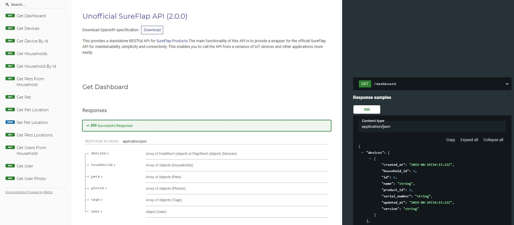

# SureFlap API

SureFlap API is a standalone RESTful API for products from [Sure Petcare](https://www.surepetcare.com). The main functionality of this API is to provide a wrapper for the official SureFlap API for maintainability, simplicity and connectivity. This enables a variety of IoT devices and other applications to connect to SureFlap devices more easily. The API is written in Python and completly open source.



## Requirements

- Python >= 3.6
- (Docker)

## Installation

### Docker (recommended)

For more information about the docker image check out the official documentation at Docker Hub: [fabieu/sureflap-api](https://hub.docker.com/repository/docker/fabieu/sureflap-api)

```docker
docker run -d -p 8080:3001 fabieu/sureflap-api:latest {Options}
```

### Manual

Clone this repository to your system and move into the sureflap project folder:

```bash
git clone https://github.com/fabieu/sureflap-api.git && cd ./sureflap-api/sureflap
```

This project utilizes **Pipenv**, a production-ready tool that aims to bring the best of all packaging worlds to the Python world. It harnesses Pipfile, pip, and virtualenv into one single command. You can read more about Pipenv [here](https://pipenv-fork.readthedocs.io/en/latest/).

Install pipenv via Pip:

```bash
pip install --user pipenv
```

Installing required dependencies and move into the virtual environment created by Pipenv:

```bash
pipenv install && pipenv shell
```

Start the API with the following command:

```bash
pipenv run python server.py {Options}
```

## Options

For an overview of all available options call the help option `python server.py --help`

### Option: `--email` (required)

Email of your _Sure Petcare_ account. Make sure to use an account with control privileges if you want to use the full capabilities of this API. You can change the privileges on the official Sure Petcare website.

### Option: `--password` (required)

Password of the in `email` specified _Sure Petcare_ account.

### Option: `--loglevel` (optional)

> Default: warning

The `loglevel` option controls the level of log output and can be changed to be more or less verbose, which might be useful when you are dealing with an unknown issue.

- `trace`: Show every detail, like all called internal functions.
- `debug`: Shows detailed debug information.
- `info`: Normal (usually) interesting events.
- `warning`: Exceptional occurrences that are not errors.
- `error`: Runtime errors that do not require immediate action.
- `fatal`: Something went terribly wrong. Add-on becomes unusable.

### Option: `--port` (optional)

> Default: 3001

The port for the ASGI server. This is the same as the port used for API requests. Please make sure that the specified port isn't used by another application.

### Option: `--cors` (optional)

> Default: None

Enables CORS (Cross-Origin Resource Sharing) for the specified domain names or ip adresses. Define a comma-seperated list of fully qualified domain names or ip adresses or `*` to enable CORS for all domains. The latter is not recommended from a security perspective.

## Usage

For the details about the REST API take a look at the automatically generated OpenAPI Specification at `http://{IP_ADRESS}:{PORT}/docs` or `http://{IP_ADRESS}:{PORT}/redoc`. There you can find everything you need to know about the functions and how to call them correctly.

If you have additional questions feel free to open an issue here on GitHub.

## Changelog & Releases

This repository keeps a changelog using GitHub's releases functionality.

Releases are based on Semantic Versioning, and use the format of `MAJOR.MINOR.PATCH`. In short, the version will be incremented based on the following:

- `MAJOR`: Incompatible or major changes.
- `MINOR`: Backwards-compatible new features and enhancements.
- `PATCH`: Backwards-compatible bugfixes and package updates.

## Special Thanks

Thanks to [alextoft](https://github.com/alextoft) and [hdurdle](https://github.com/hdurdle) for their GitHub projects and shared resources about the SureFlap API.  
You can look at the projects following the links below:

- https://github.com/alextoft/sureflap
- https://github.com/hdurdle/sureflap

## Licence

Copyright 2020-2021 Fabian Eulitz

Licensed under the Apache License, Version 2.0 (the "License"); you may not use this file except in compliance with the License. You may obtain a copy of the License at

http://www.apache.org/licenses/LICENSE-2.0

Unless required by applicable law or agreed to in writing, software distributed under the License is distributed on an "AS IS" BASIS, WITHOUT WARRANTIES OR CONDITIONS OF ANY KIND, either express or implied. See the License for the specific language governing permissions and limitations under the License.

## Disclaimer

### This project isn’t endorsed by SureFlap Ltd. and doesn’t reflect the views or opinions of SureFlap Ltd. or anyone officially involved in producing or managing Sure Petcare.
